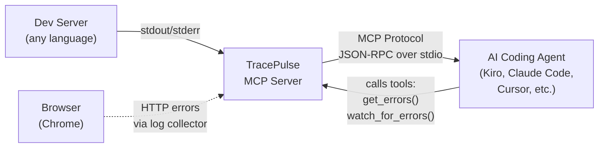
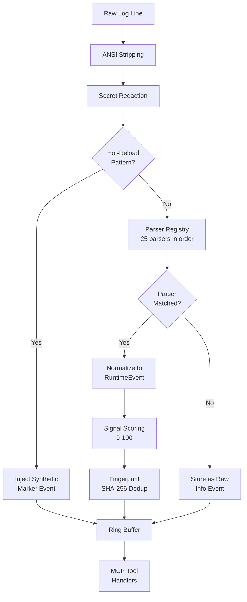
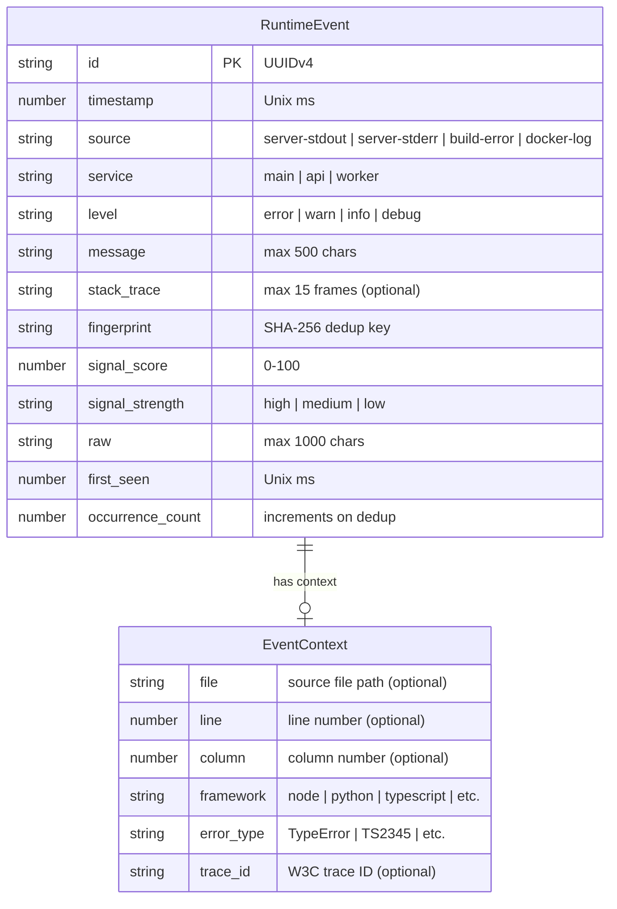
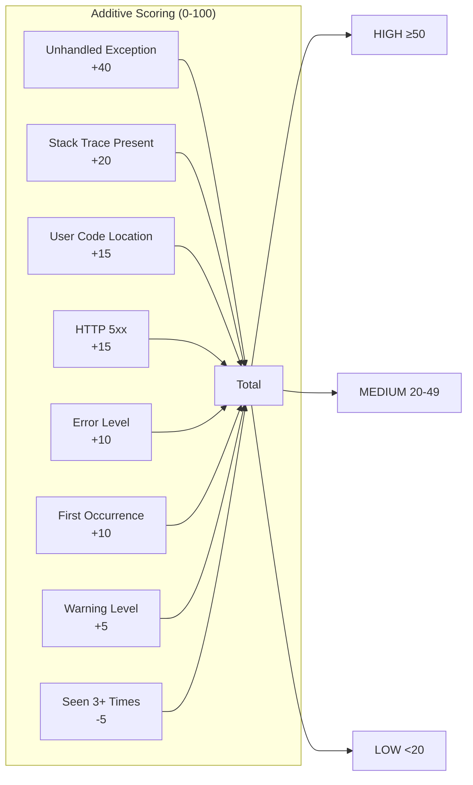
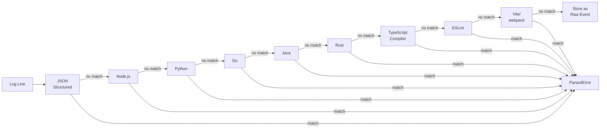
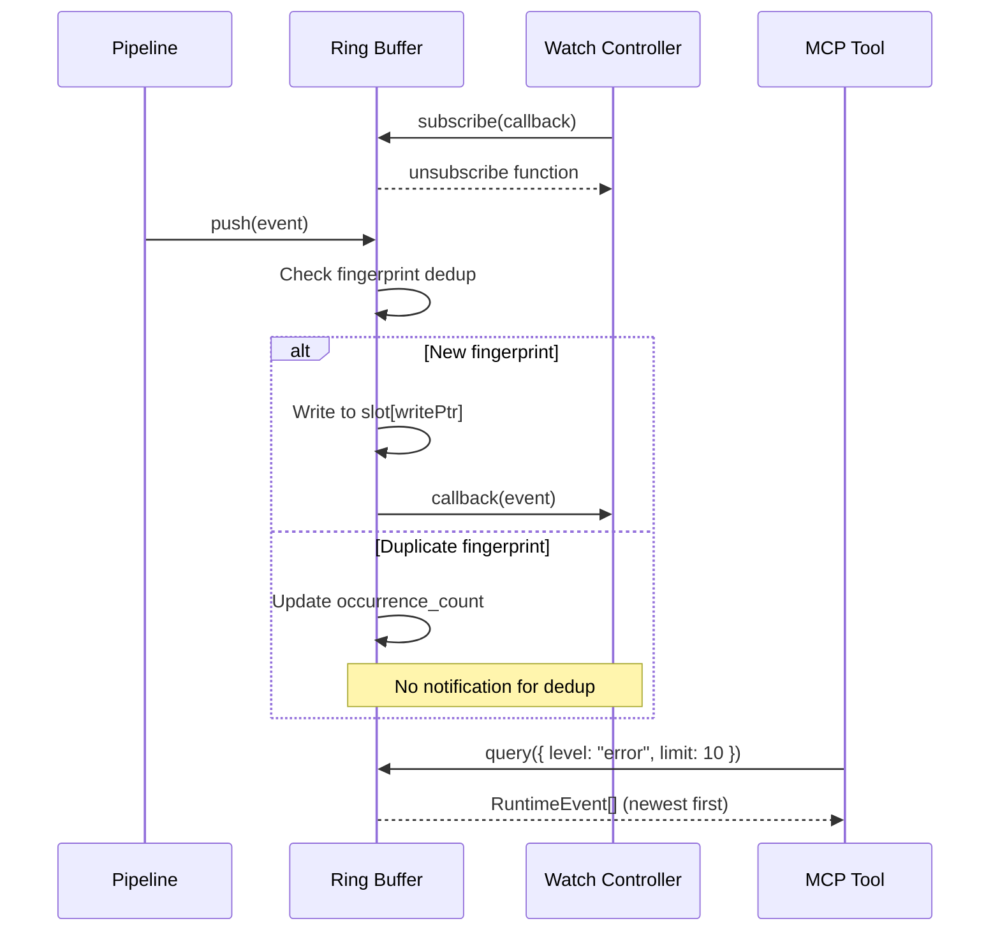
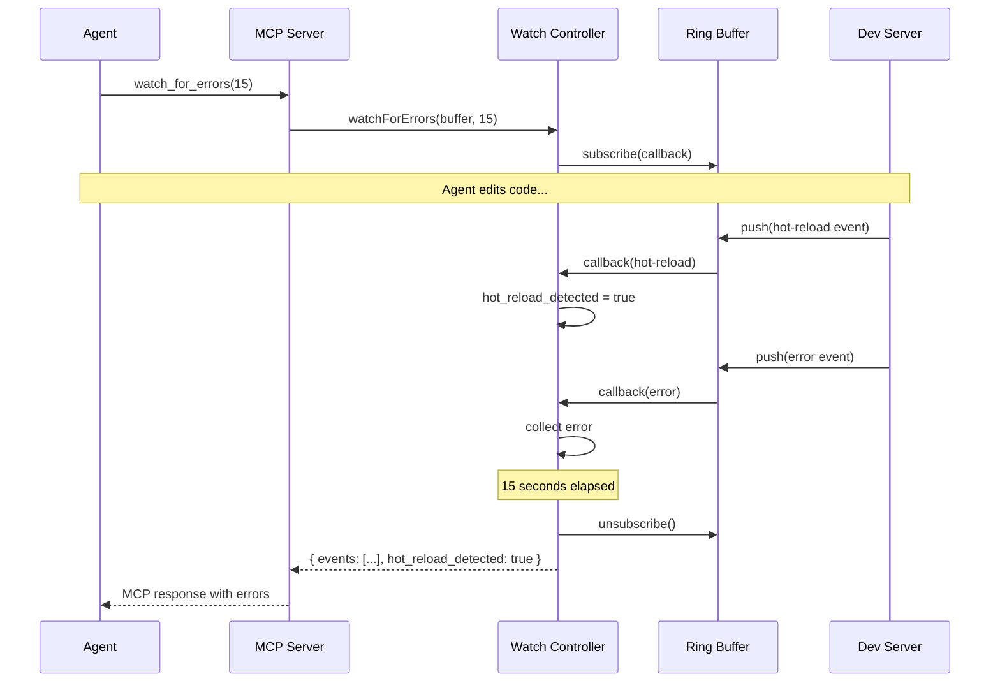
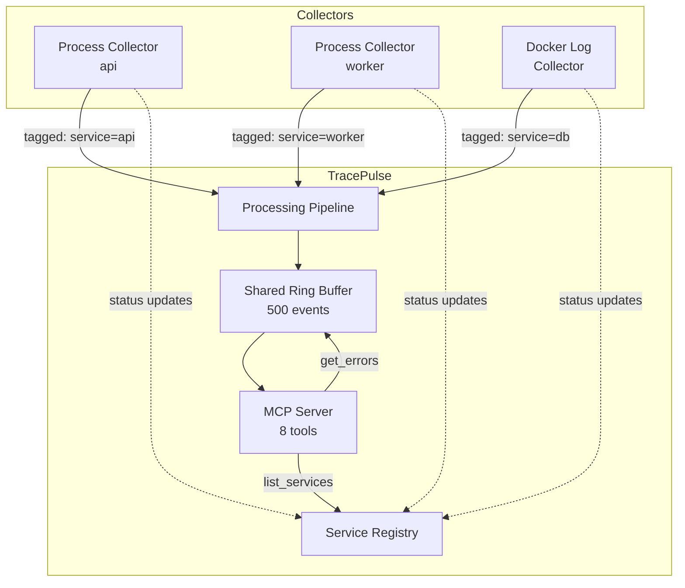
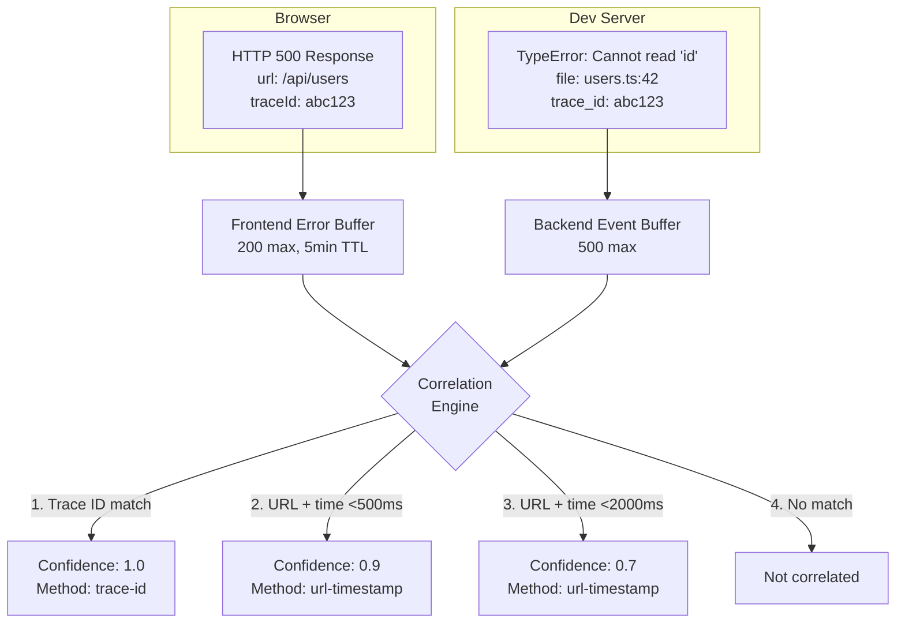
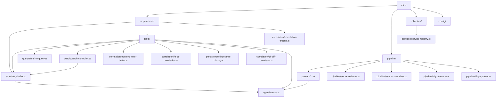

# TracePulse Architecture Diagrams

Mermaid diagrams for key architectural concepts. Render these in any Mermaid-compatible viewer (GitHub, VS Code, etc.).

---

## 1. High-Level System Context

---

## 2. Data Pipeline Flow

---

## 3. RuntimeEvent Entity

---

## 4. Signal Scoring Breakdown

---

## 5. Parser Registry Priority

---

## 6. Ring Buffer with Subscription

---

## 7. Watch Mode Flow

---

## 8. Multi-Process Architecture

---

## 9. Frontend-Backend Correlation

---

## 10. Module Dependency Graph

