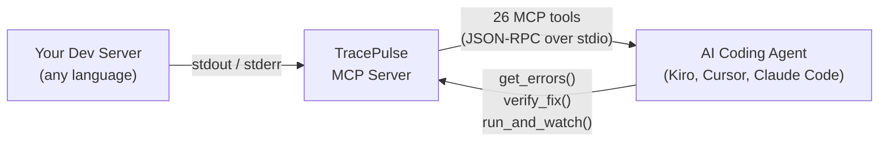
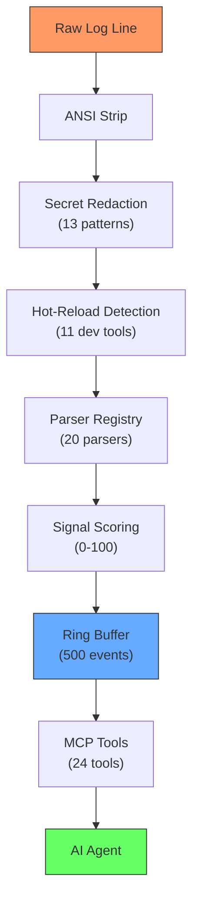
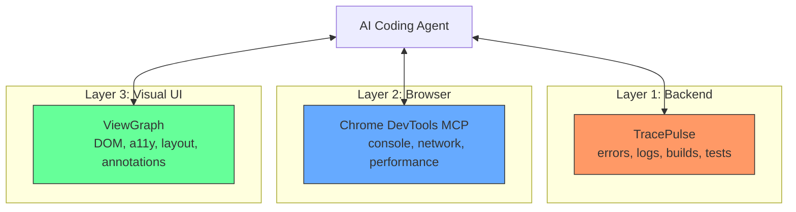
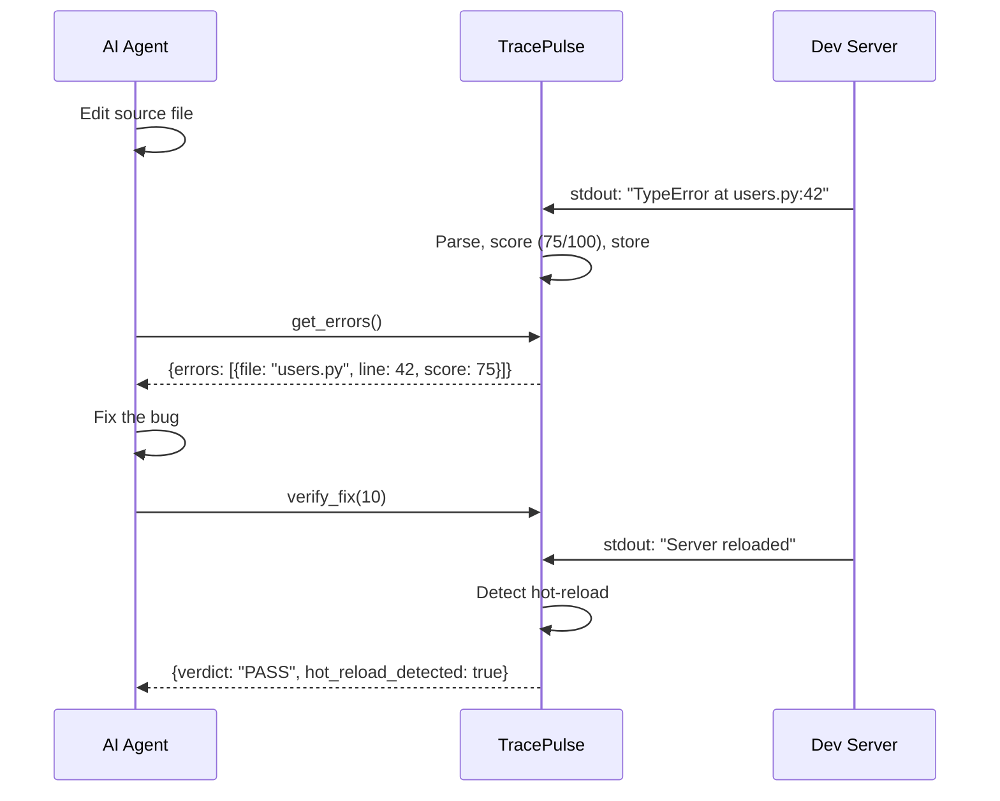

# The Backend Feedback Layer for AI Coding Agents

**TracePulse - Runtime feedback MCP server.**

[ViewGraph](https://chaoslabz.gitbook.io/viewgraph) sees the UI. TracePulse feels the backend.

> "LLMs can't see what happens when their code actually runs. They're throwing darts in the dark."
> - [Sentry Engineering](https://blog.sentry.io/vibe-coding-closing-the-feedback-loop-with-traceability/)

TracePulse closes this loop at dev time - seconds after the code change, not minutes after deployment.

## How It Works



TracePulse watches your dev server's output, parses errors from [20 sources](features/parsers.md) ([Node.js](https://nodejs.org), [Python](https://python.org), [Go](https://go.dev), [Java](https://dev.java), [Rust](https://www.rust-lang.org), [TypeScript](https://www.typescriptlang.org), and more), [scores them by importance](features/signal-scoring.md), and serves them to your AI coding agent through [26 MCP tools](features/mcp-tools.md).

The agent edits code, calls `get_errors()`, and instantly knows if the fix worked.

## The Data Pipeline



## The Three-Layer Debugging Stack



Each tool owns its layer. Together they give the AI agent complete visibility into your application.

## The Communication Model



## Quick Links

- [Quick Start (2 minutes) ->](getting-started/quick-start.md)
- [26 MCP Tools ->](features/mcp-tools.md)
- [20 Error Parsers ->](features/parsers.md)
- [How It Works ->](architecture/how-it-works.md)
- [Feature Matrix vs Competitors ->](comparison/feature-matrix.md)

## Install

```json
{
  "mcpServers": {
    "tracepulse": {
      "command": "npx",
      "args": ["tracepulse", "start", "npm run dev"]
    }
  }
}
```

Works with [Kiro](getting-started/mcp-client-setup.md), [Cursor](getting-started/mcp-client-setup.md), [Claude Desktop](getting-started/mcp-client-setup.md), [VS Code](getting-started/mcp-client-setup.md), [Windsurf](getting-started/mcp-client-setup.md), and any MCP-compatible agent.
