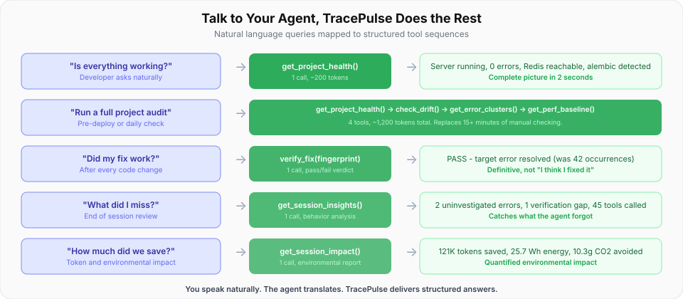

# The Backend Feedback Layer for AI Coding Agents

<figure></figure>

**TracePulse - Runtime feedback MCP server.**

*Fewer wasted tokens. Faster shipping. Lower carbon footprint. Responsible AI in action.*

[[ViewGraph](https://chaoslabz.gitbook.io/viewgraph) sees the UI. TracePulse hears the backend.

> "LLMs can't see what happens when their code actually runs. They're throwing darts in the dark."
> - [Sentry Engineering](https://blog.sentry.io/vibe-coding-closing-the-feedback-loop-with-traceability/)

TracePulse closes this loop at dev time - seconds after the code change, not minutes after deployment.

[](https://www.npmjs.com/package/tracepulse) &nbsp; [](https://github.com/sourjya/tracepulse)

<figure></figure>

---

## The Problem

**AI coding agents can write code. They cannot see what happens when it runs.**

- The agent edits a file but **can't tell if the server crashed**
- Errors pile up in terminal logs that the agent **never reads**
- Build failures are invisible until the developer **manually checks**
- The agent iterates blindly, **compounding errors** on top of errors
- Debugging requires **copy-pasting logs** into the chat

These problems cost 15-30 minutes per debugging session. TracePulse eliminates them.

---

## Why It Matters Beyond Productivity

Every wasted token is wasted compute, wasted energy, and avoidable carbon emissions.

- [59.4% of token consumption](https://arxiv.org/html/2601.14470v1) in agentic coding goes to the agent re-reading its own work (arXiv 2601.14470)
- Global data center electricity demand projected to [double to ~945 TWh by 2030](https://www.iea.org/news/ai-is-set-to-drive-surging-electricity-demand-from-data-centres-while-offering-the-potential-to-transform-how-the-energy-sector-works) - more than Japan's entire consumption (IEA, 2025)
- [LLM inference accounts for >90%](https://arxiv.org/html/2512.03024) of total AI power consumption - not training (arXiv 2512.03024)
- Data center CO2 emissions projected to rise from [~220M to 320M tonnes by 2035](https://www.iea.org/reports/energy-and-ai/ai-and-climate-change) (IEA)

**The chain:** Wasted tokens -> wasted GPU cycles -> wasted data center energy -> avoidable carbon emissions. TracePulse breaks this chain at the source.

<figure></figure>

---

## Your Agent Is Wasting Tokens

Research from [Morph](https://www.morphllm.com) (2026), [Cognition](https://cognition.ai) internal measurements, and [SWE-Pruner](https://arxiv.org/abs/2601.16746) (arXiv 2601.16746) shows AI agents spend **60-80% of their token budget** on orientation and retrieval, not problem-solving. One developer [tracked every token](https://ide.com/i-tracked-every-token-my-ai-coding-agent-consumed-for-a-week-70-was-waste/) across 42 Claude Code sessions on a real codebase and found **70% waste** - an average of 23 file-read tool calls per prompt, with only 50K of 180K tokens actually relevant to the question.

<figure></figure>

TracePulse pre-parses, scores, and deduplicates. The agent gets the exact file:line in one call instead of scanning raw logs.

**That's 12,000 tokens down to 1,000. Per error. Per session.** (Measured in live debugging sessions - see [TracePulse in Action](tutorials/tracepulse-in-action.md))

---

## What Makes It Different

| Capability | TracePulse | Sentry MCP | Chrome DevTools | BrowserTools |
|-----------|:---------:|:---------:|:--------------:|:-----------:|
| Backend error parsing | **Yes (26)** | Yes (prod) | No | No |
| Signal scoring (0-100) | **Yes** | No | No | No |
| Fingerprint dedup | **Yes** | No | No | No |
| Hot-reload detection | **Yes (12)** | No | No | No |
| Dev-time (seconds) | **Yes** | No (minutes) | Yes | Yes |
| Works without browser | **Yes** | Yes | No | No |
| Test runner integration | **Yes** | No | No | No |
| Infrastructure discovery | **Yes** | No | No | No |
| Agent skill files | **Yes (10)** | No | No | No |
| Zero config | **Yes** | No | Yes | No |

[Full feature matrix ->](comparison/feature-matrix.md)

---

## Real-World Results

From live agent sessions across 4 projects (full-stack web app, TypeScript library, Python backend, shared libraries):

| Metric | Value |
|--------|-------|
| Token reduction per error | 12x (measured) |
| Chokepoints caught by TP | 7/8 (88%) |
| Avg attempts before fix | 1.5 (structured file:line) |
| Tool calls per session | 40-70 |
| Schema overhead reduction | 80% (clustered mode) |
| Agent wishlist items shipped | 24/38 (63%) |
| Real bugs caught per session | 3 |

<figure></figure>

---

## Just Ask

You don't need to remember tool names. Ask your agent naturally and TracePulse translates:

<figure></figure>

[See all query mappings ->](tutorials/project-audit.md)

---

## Install

```json
{
  "mcpServers": {
    "tracepulse": {
      "command": "npx",
      "args": ["tracepulse", "start", "npm run dev"]
    }
  }
}
```

Works with [Kiro](getting-started/mcp-client-setup.md), [Cursor](getting-started/mcp-client-setup.md), [Claude Desktop](getting-started/mcp-client-setup.md), [VS Code](getting-started/mcp-client-setup.md), [Windsurf](getting-started/mcp-client-setup.md), and any MCP-compatible agent.

---

## Cloud Log Monitoring

Monitor 9 cloud platforms with zero additional dependencies:

| Platform | Command |
|----------|---------|
| **[AWS CloudWatch](https://docs.aws.amazon.com/cli/latest/userguide/getting-started-install.html)** | `run_and_watch("aws logs tail /aws/lambda/my-fn --follow")` |
| **[Google Cloud](https://cloud.google.com/sdk/docs/install)** | `run_and_watch("gcloud logging tail '...'")` |
| **[Azure](https://learn.microsoft.com/en-us/cli/azure/install-azure-cli)** | `run_and_watch("az webapp log tail --name my-app")` |
| **[Kubernetes](https://kubernetes.io/docs/tasks/tools/)** | `run_and_watch("kubectl logs -f deployment/my-app")` |
| **[Docker](https://docs.docker.com/get-started/get-docker/)** | `run_and_watch("docker logs -f my-container")` |
| **[Heroku](https://devcenter.heroku.com/articles/heroku-cli)** | `run_and_watch("heroku logs --tail --app my-app")` |
| **[Vercel](https://vercel.com/docs/cli)** / **[Railway](https://docs.railway.com/guides/cli)** / **[Fly.io](https://fly.io/docs/flyctl/install/)** | Same pattern with their CLIs |

The same 26 parsers that catch local dev server errors catch cloud errors too.

[Full cloud monitoring guide ->](tutorials/cloud-logs.md)

---

## Open Source

AGPL-3.0 licensed. Full source on [GitHub](https://github.com/sourjya/tracepulse).

| Resource | Link |
|----------|------|
| npm | [npmjs.com/package/tracepulse](https://www.npmjs.com/package/tracepulse) |
| GitHub | [github.com/sourjya/tracepulse](https://github.com/sourjya/tracepulse) |
| Docs | [chaoslabz.gitbook.io/tracepulse](https://chaoslabz.gitbook.io/tracepulse) |

---

## Quick Links

- [Quick Start (2 minutes) ->](getting-started/quick-start.md)
- [44 MCP Tools ->](features/mcp-tools.md)
- [26 Error Parsers ->](features/parsers.md)
- [How It Works ->](architecture/how-it-works.md)
- [Feature Matrix vs Competitors ->](comparison/feature-matrix.md)
- [The Three-Layer Stack ->](architecture/three-layer-stack.md)
