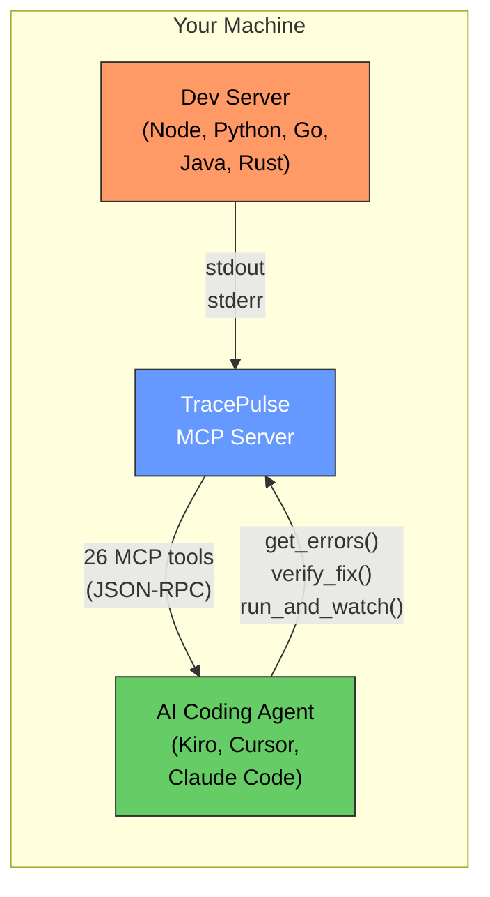
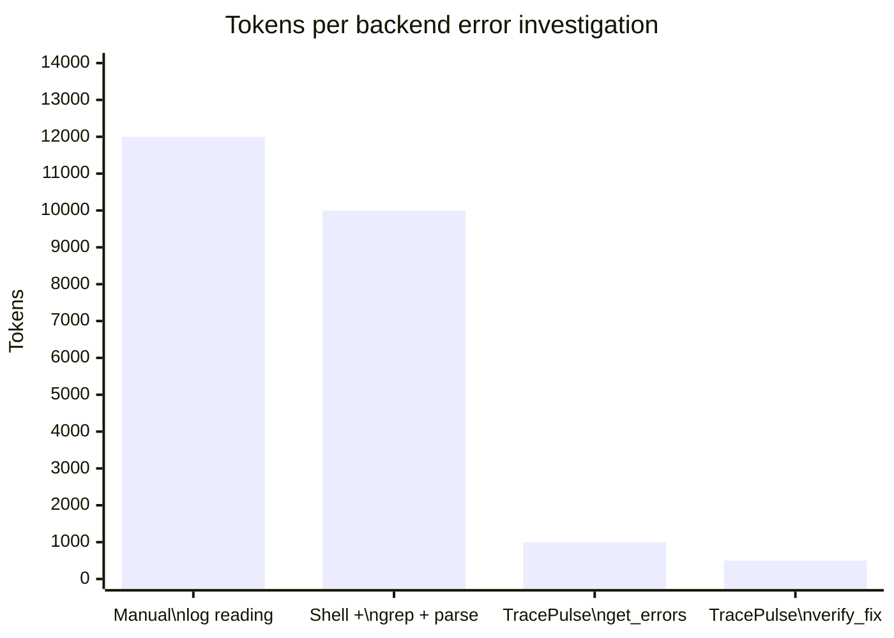
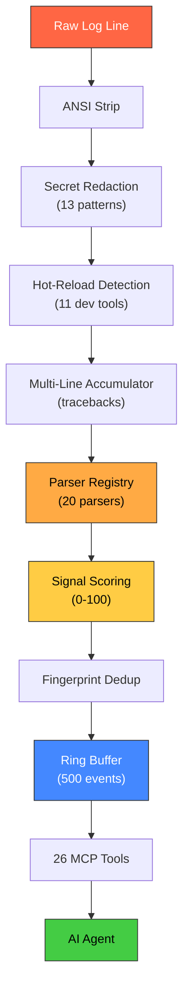
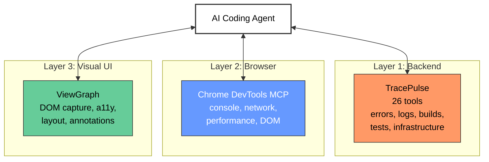
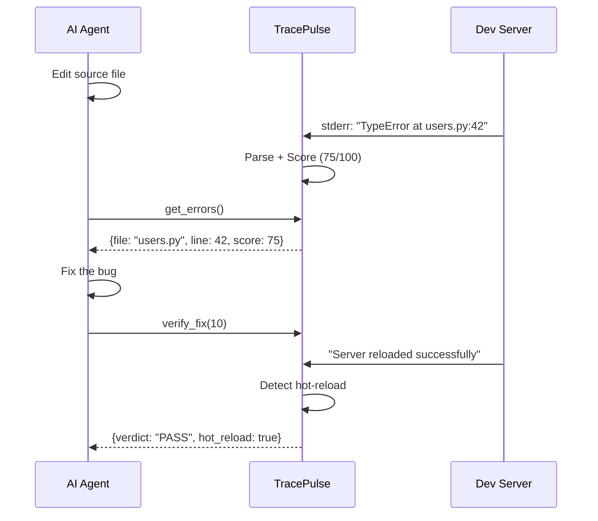
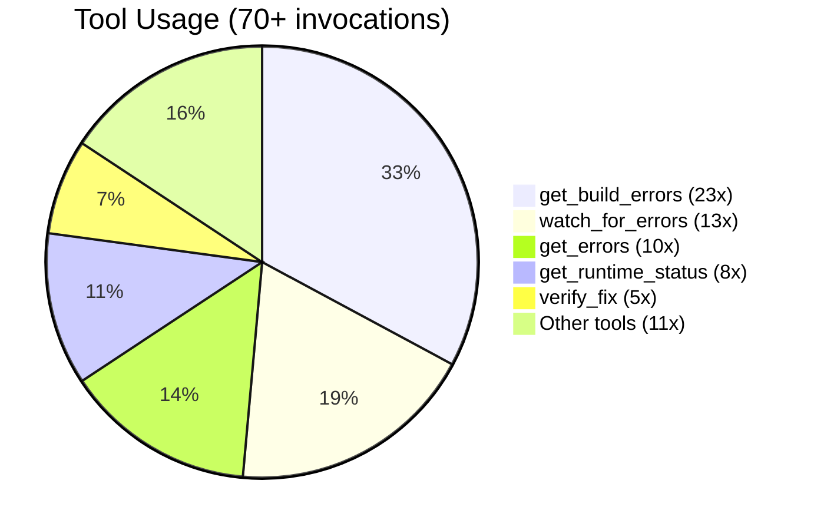

# The Backend Feedback Layer for AI Coding Agents

**TracePulse - Runtime feedback MCP server.**

[ViewGraph](https://chaoslabz.gitbook.io/viewgraph) sees the UI. TracePulse feels the backend.

> "LLMs can't see what happens when their code actually runs. They're throwing darts in the dark."
> - [Sentry Engineering](https://blog.sentry.io/vibe-coding-closing-the-feedback-loop-with-traceability/)

TracePulse closes this loop at dev time - seconds after the code change, not minutes after deployment.

[](https://www.npmjs.com/package/tracepulse) [](https://github.com/sourjya/tracepulse)

---

## The Problem

**AI coding agents can write code. They cannot see what happens when it runs.**

- The agent edits a file but **can't tell if the server crashed**
- Errors pile up in terminal logs that the agent **never reads**
- Build failures are invisible until the developer **manually checks**
- The agent iterates blindly, **compounding errors** on top of errors
- Debugging requires **copy-pasting logs** into the chat

These problems cost 15-30 minutes per debugging session. TracePulse eliminates them.

---

## How It Works



---

## Your Agent Is Wasting Tokens on Log Reading

Research shows AI agents spend **60-80% of their token budget** on orientation and retrieval, not problem-solving. One study found an agent reading 25 files to answer a question that needed 3.



TracePulse pre-parses, scores, and deduplicates. The agent gets the exact file:line in one call instead of scanning raw logs.

**That's 12,000 tokens down to 1,000. Per error. Per session.**

---

## The Data Pipeline

Every log line goes through 10 stages before the agent sees it:



---

## The Three-Layer Debugging Stack



Each tool owns its layer. Together they give the agent complete visibility.

---

## The Edit-Verify Loop



---

## What Makes It Different

| Capability | TracePulse | Sentry MCP | Chrome DevTools | BrowserTools |
|-----------|:---------:|:---------:|:--------------:|:-----------:|
| Backend error parsing | **Yes (20)** | Yes (prod) | No | No |
| Signal scoring (0-100) | **Yes** | No | No | No |
| Fingerprint dedup | **Yes** | No | No | No |
| Hot-reload detection | **Yes (11)** | No | No | No |
| Dev-time (seconds) | **Yes** | No (minutes) | Yes | Yes |
| Works without browser | **Yes** | Yes | No | No |
| Test runner integration | **Yes** | No | No | No |
| Infrastructure discovery | **Yes** | No | No | No |
| Agent skill files | **Yes (10)** | No | No | No |
| Zero config | **Yes** | No | Yes | No |

[Full feature matrix ->](comparison/feature-matrix.md)

---

## Real-World Results

From 3 agent sessions on a production project:



| Metric | Value |
|--------|-------|
| Manual vite builds replaced | 15+ |
| Time saved (build checks) | 20+ minutes |
| Real bugs caught | 3 |
| Feature request to bug catch | Same day |
| Agent wishlist items shipped | 21/22 (95%) |

---

## Install

```json
{
  "mcpServers": {
    "tracepulse": {
      "command": "npx",
      "args": ["tracepulse", "start", "npm run dev"]
    }
  }
}
```

Works with [Kiro](getting-started/mcp-client-setup.md), [Cursor](getting-started/mcp-client-setup.md), [Claude Desktop](getting-started/mcp-client-setup.md), [VS Code](getting-started/mcp-client-setup.md), [Windsurf](getting-started/mcp-client-setup.md), and any MCP-compatible agent.

---

## Open Source

AGPL-3.0 licensed. Full source on [GitHub](https://github.com/sourjya/tracepulse).

| Resource | Link |
|----------|------|
| npm | [npmjs.com/package/tracepulse](https://www.npmjs.com/package/tracepulse) |
| GitHub | [github.com/sourjya/tracepulse](https://github.com/sourjya/tracepulse) |
| Docs | [chaoslabz.gitbook.io/tracepulse](https://chaoslabz.gitbook.io/tracepulse) |

---

## Quick Links

- [Quick Start (2 minutes) ->](getting-started/quick-start.md)
- [26 MCP Tools ->](features/mcp-tools.md)
- [20 Error Parsers ->](features/parsers.md)
- [How It Works ->](architecture/how-it-works.md)
- [Feature Matrix vs Competitors ->](comparison/feature-matrix.md)
- [The Three-Layer Stack ->](architecture/three-layer-stack.md)
