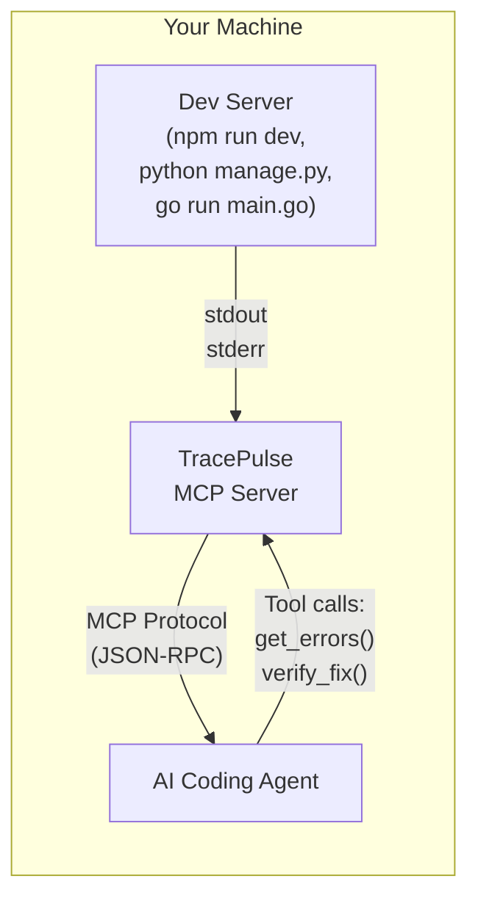
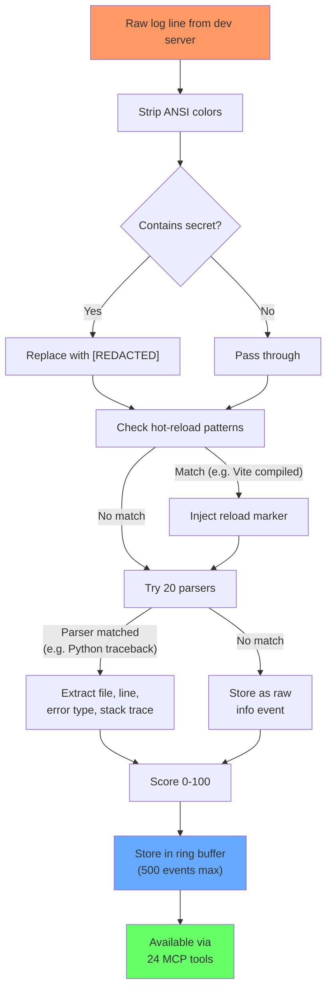
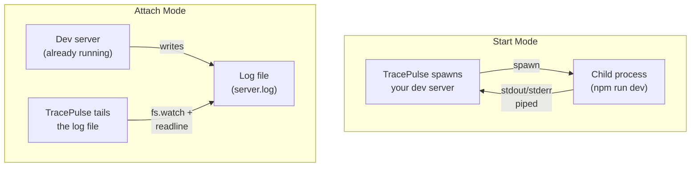
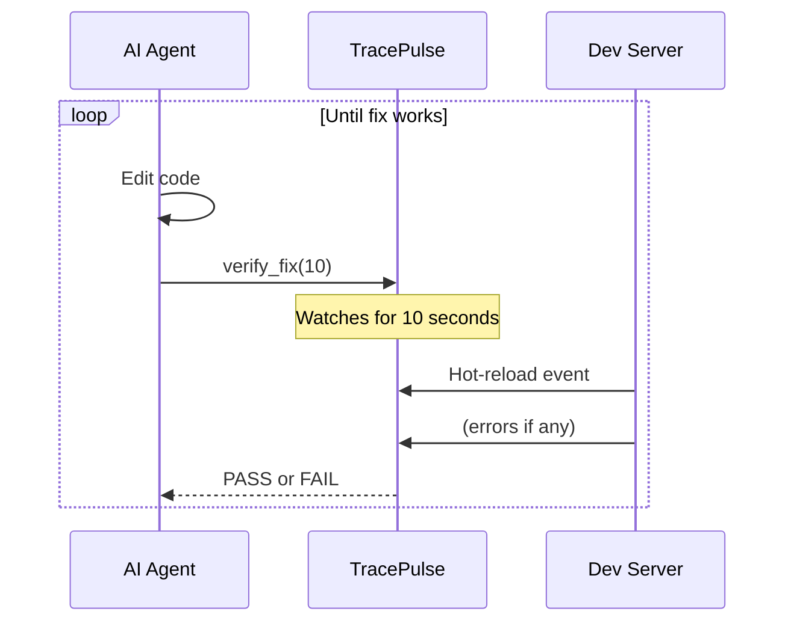

# How It Works

TracePulse sits between your dev server and your AI agent. It reads logs, parses errors, and serves structured data.

## The Big Picture

## What Happens to Each Log Line

## Two Modes of Operation

## The Edit-Verify Loop

## Learn More

- [Data Pipeline (10 stages)](pipeline.md)
- [Signal Scoring](../features/signal-scoring.md)
- [20 Error Parsers](../features/parsers.md)
- [The Three-Layer Stack](three-layer-stack.md)
