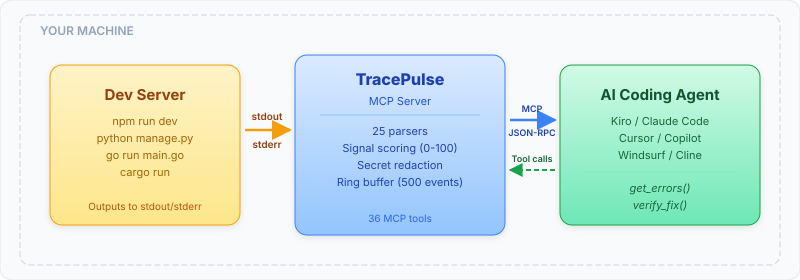
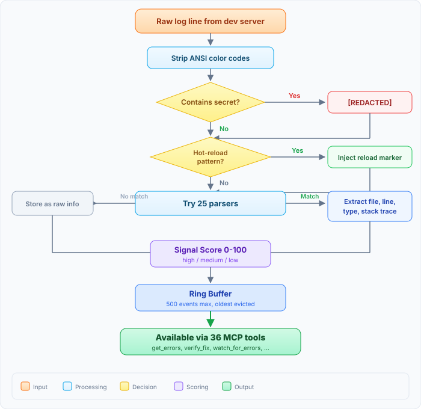
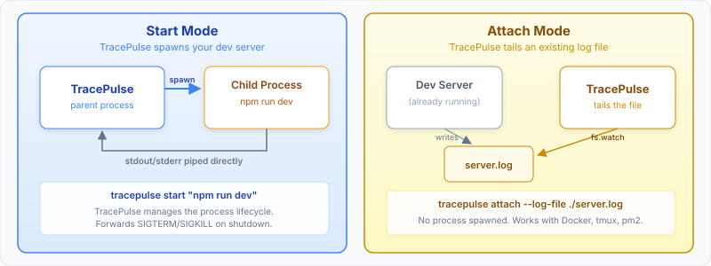
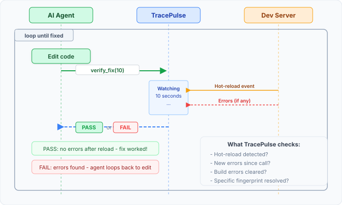

# How It Works

TracePulse sits between your dev server and your AI agent. It reads logs, parses errors, and serves structured data.

## The Big Picture

<figure><figcaption></figcaption></figure>

Your dev server outputs to stdout/stderr. TracePulse captures that output, runs it through 26 parsers, scores each event, and stores it in a ring buffer. The AI agent calls MCP tools like [`get_errors`](../features/mcp-tools.md#get_errors) and [`verify_fix`](../features/mcp-tools.md#verify_fix) to read structured results - no log parsing needed.

## What Happens to Each Log Line

<figure><figcaption></figcaption></figure>

Every line flows through the same pipeline:

1. **Strip ANSI** - remove terminal color codes
2. **Secret check** - 16 patterns (API keys, tokens, connection strings) replaced with `[REDACTED]`
3. **Hot-reload detection** - 12 dev tools recognized (Vite, webpack, nodemon, uvicorn, etc.)
4. **Parse** - 26 framework-specific parsers try to extract structured data (file, line, error type, stack trace)
5. **Score** - signal score 0-100 based on error type, stack trace quality, and infrastructure patterns
6. **Store** - ring buffer holds the last 500 events, oldest evicted first

## Two Modes of Operation

<figure><figcaption></figcaption></figure>

**Start mode** spawns your dev server as a child process and pipes stdout/stderr directly. TracePulse manages the lifecycle - it forwards SIGTERM on shutdown.

**Attach mode** tails an existing log file via `fs.watch`. Use this when your servers are already running - managed by Docker, tmux, pm2, or systemd.

## The Edit-Verify Loop

<figure><figcaption></figcaption></figure>

This is the core workflow. The agent edits code, calls `verify_fix(10)`, and TracePulse watches for 10 seconds. If the server hot-reloads cleanly with no new errors, it returns PASS. If errors appear, it returns FAIL with the details - and the agent loops back to fix.

## Learn More

- [Data Pipeline (10 stages)](pipeline.md)
- [Signal Scoring](../features/signal-scoring.md)
- [26 Error Parsers](../features/parsers.md)
- [The Three-Layer Stack](three-layer-stack.md)
