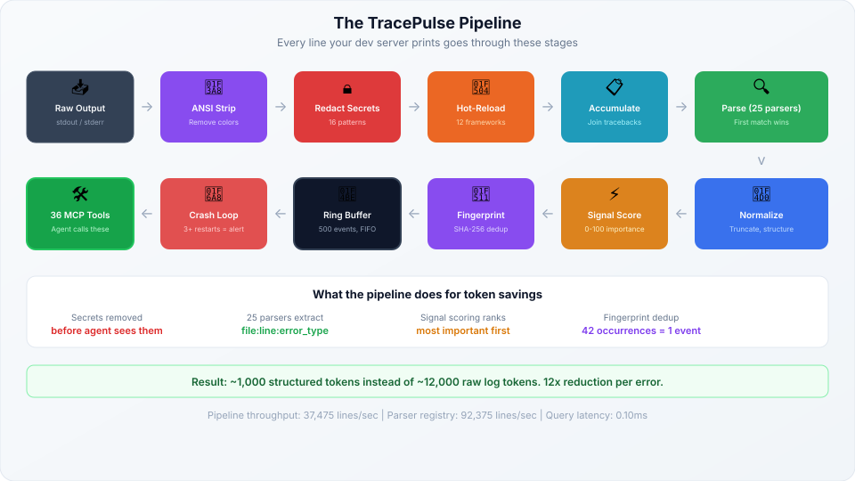

# Data Pipeline

Every line your dev server prints goes through 10 stages before the AI agent sees it. The pipeline transforms raw, noisy terminal output into structured, scored, deduplicated data the agent can act on immediately.

<figure></figure>

---

## Stage 1: Raw Input

Your dev server prints to stdout and stderr. TracePulse captures every line - error messages, access logs, build output, hot-reload notifications, warnings, everything. The agent never needs to read the terminal.

## Stage 2: ANSI Stripping

Terminal output is full of color codes (`\033[31m` for red, `\033[0m` for reset). These are visual formatting for humans - useless noise for an AI agent. TracePulse strips them all, saving the agent from parsing invisible characters.

## Stage 3: Secret Redaction

Before any data enters the pipeline, TracePulse scans for secrets: API keys, JWT tokens, database passwords, AWS credentials, GitHub tokens, and 10 more patterns (16 total). Every match is replaced with `[REDACTED]`. The agent never sees your secrets - not in tool responses, not in the ring buffer, not anywhere.

## Stage 4: Hot-Reload Detection

When you save a file, your dev server reloads. TracePulse recognizes reload messages from 12 frameworks (Vite, webpack, nodemon, Next.js, uvicorn, Django, Flask, air, and more). It injects a synthetic marker event so [`watch_for_errors`](../features/mcp-tools.md#watch_for_errors) can tell the agent "your change just took effect."

## Stage 5: Multi-Line Accumulation

Some errors span multiple lines. A Python traceback might be 15 lines. A Java exception with "Caused by:" chains can be 30+. TracePulse buffers consecutive lines that belong together and feeds them to the parser as a single block. Without this, the parser would see fragments instead of complete errors.

## Stage 6: Parser Registry

The accumulated line hits 25 framework-specific parsers in priority order. The first parser that matches wins. Each parser extracts structured data: error type, message, file path, line number, and scoring hints. If no parser matches, the line becomes a raw info-level event (still searchable, just not structured).

**Parsers cover:** Node.js, Python, Pydantic, Go, Java/Spring Boot, Rust, JSON logs, Structlog, HTTP access logs, TypeScript, ESLint, Vite/webpack, pytest, Jest, vitest, Go test, cargo test, JUnit/Maven/Gradle, Celery, Sidekiq, BullMQ, npm audit, coverage, migration, build stats.

## Stage 7: Normalization

The parsed result is converted into a `RuntimeEvent` - TracePulse's universal error format. Messages are truncated to 500 characters, stack traces to 15 frames, raw lines to 1,000 characters. This keeps every event a predictable size - no 10,000-token stack traces bloating the agent's context.

## Stage 8: Signal Scoring

Every event gets a score from 0 to 100 based on:
- Is it an unhandled exception? (+30)
- Does it have a stack trace? (+10)
- Is the stack trace in user code (not node_modules)? (+15)
- Is it an HTTP 5xx? (+25) Or 4xx? (+10)
- Is it the first time this fingerprint appeared? (+5)

The agent sees errors sorted by score - the most important bug is always first. No more reading 50 log lines to find the one that matters.

## Stage 9: Fingerprinting

A SHA-256 hash is computed from the error's source, normalized message, and file:line. If the same error fires 42 times, it appears once in the buffer with `occurrence_count: 42`. The agent reads one structured event instead of 42 raw log entries. This is the single biggest token saver - deduplication alone can reduce token consumption by 40x on high-occurrence errors.

## Stage 10: Ring Buffer + Crash Loop Detection

Events are stored in a 500-slot circular buffer. When full, the oldest event is overwritten (FIFO). High-signal errors (score >= 50) are pinned and survive eviction. If the server restarts 3+ times in 60 seconds, TracePulse injects a crash loop alert at signal_score 95.

The buffer is what MCP tools read from. [`get_errors`](../features/mcp-tools.md#get_errors), [`get_build_errors`](../features/mcp-tools.md#get_build_errors), [`verify_fix`](../features/mcp-tools.md#verify_fix) - they all query this buffer. The pipeline ensures that by the time data reaches the buffer, it's clean, structured, scored, and deduplicated.

---

## The Result

| What the agent would read | What TracePulse returns |
|--------------------------|----------------------|
| 50 raw log lines with ANSI colors | 3 structured errors sorted by importance |
| Same error repeated 42 times | 1 event with occurrence_count: 42 |
| Stack trace with 15 framework frames | 2 user-code frames with file:line |
| "Something went wrong" | "TypeError at auth.py:42, score 85, fix: check null" |
| ~12,000 tokens | ~1,000 tokens |
