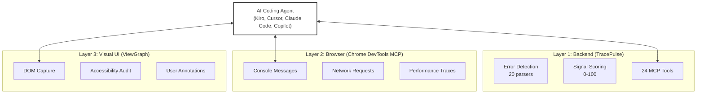
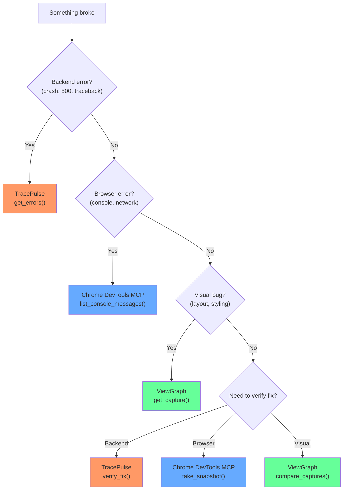
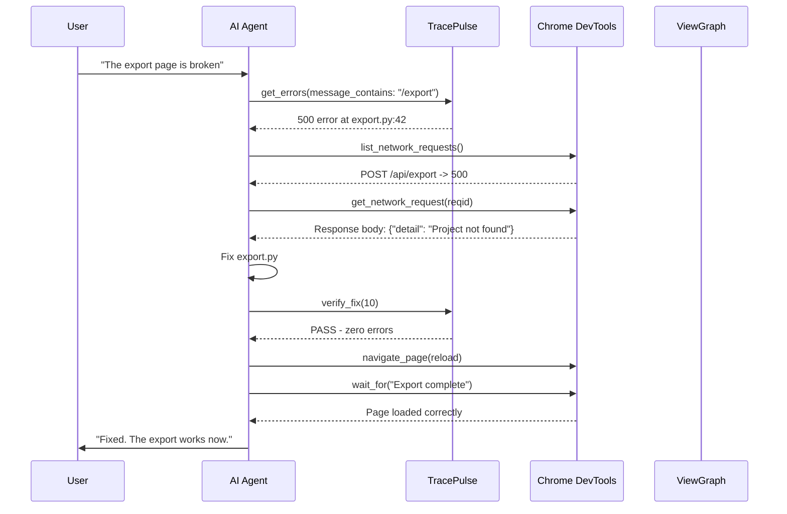

# The Three-Layer Stack

The complete agentic debugging stack has three layers. Each tool owns its layer.

## The Stack

## When to Use Which

## Data Flow Across Layers

## Responsibility Matrix

| Capability | TracePulse | Chrome DevTools MCP | ViewGraph |
|------------|:---------:|:-------------------:|:---------:|
| Backend exceptions | **Yes** | | |
| Build/compile errors | **Yes** | | |
| Test failures | **Yes** | | |
| Browser console | | **Yes** | |
| Network requests | | **Yes** | |
| Request/response bodies | | **Yes** | |
| Screenshots | | **Yes** | |
| DOM inspection | | **Yes** | **Yes** |
| Accessibility audit | | **Yes** | **Yes** |
| User annotations | | | **Yes** |
| Visual regression | | | **Yes** |
