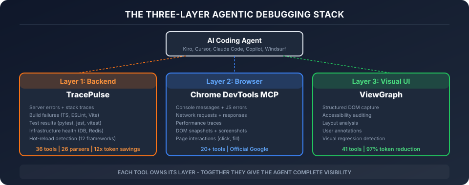
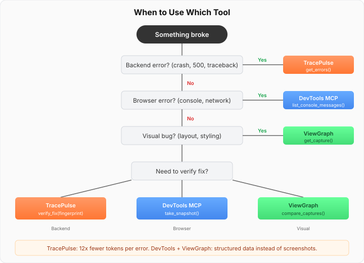

# The Three-Layer Debugging Stack

A senior developer debugging a broken feature does three things simultaneously: looks at the UI, checks the browser console and network tab, and reads the server logs. They correlate across all three in their head — "the button is there but the API returned 401, so it's an auth issue, not a frontend bug."

AI coding agents can't do this. They call one tool at a time, see one layer at a time, and frequently chase the wrong layer for 20 minutes.

The three-layer stack gives the agent the same cross-layer awareness a senior developer has.

<figure></figure>

---

## The Three Layers

| Layer | Tool | What it sees | Analogy |
|-------|------|-------------|---------|
| **Perception** | [ViewGraph](https://chaoslabz.gitbook.io/viewgraph) | DOM structure, accessibility, layout, visual regressions, user annotations | Eyes — sees the UI |
| **Action** | [Chrome DevTools MCP](https://github.com/nicholasgriffintn/chrome-devtools-mcp) | Browser console, network requests, screenshots, page interaction | Hands — acts in the browser |
| **Feedback** | **TracePulse** | Backend logs, errors, build state, process health, infrastructure | Ears — hears the server |

Each tool is independent. You can use any one alone. But together, they form a complete debugging system where the agent can see, act, and hear — just like a human developer.

---

## How They Work Together

### The Information Flow

```
┌─────────────────────────────────────────────────────────────────────┐
│                        AI Coding Agent                               │
│                  (Kiro, Claude Code, Cursor)                         │
└───────┬──────────────────┬──────────────────────┬───────────────────┘
        │                  │                      │
        ▼                  ▼                      ▼
┌───────────────┐  ┌───────────────────┐  ┌──────────────────┐
│   ViewGraph   │  │ Chrome DevTools   │  │   TracePulse     │
│               │  │      MCP          │  │                  │
│ • DOM capture │  │ • Console logs    │  │ • Backend errors │
│ • A11y audit  │  │ • Network tab     │  │ • Build failures │
│ • Layout      │  │ • Screenshots     │  │ • Process state  │
│ • Annotations │  │ • Page actions    │  │ • Git correlation│
│ • Regressions │  │ • Performance     │  │ • Cross-layer dx │
└───────────────┘  └───────────────────┘  └──────────────────┘
        │                  │                      │
        ▼                  ▼                      ▼
┌─────────────────────────────────────────────────────────────────────┐
│                    The Running Application                           │
│         Frontend (Browser)  ←→  Backend (Server)                    │
└─────────────────────────────────────────────────────────────────────┘
```

### No Coordination Required

The three tools don't talk to each other directly. They don't need to. The AI agent is the coordinator — it calls whichever tool is appropriate for the current situation, and synthesizes the results in its reasoning.

This is by design:
- **No single point of failure** — if one tool is unavailable, the others still work
- **No configuration coupling** — add or remove tools without affecting the others
- **No version dependencies** — each tool evolves independently
- **Works with any agent** — any MCP-compatible agent can use any combination

---

## Real Debugging Scenarios

### Scenario 1: "The export page is broken"

```
Agent's workflow:
1. ViewGraph → capture the page → sees "Export" button exists but shows error state
2. Chrome DevTools → list_network_requests → sees POST /api/export returned 500
3. TracePulse → get_errors → sees "TypeError: Cannot read property 'format' of undefined"
                             at src/services/export.ts:47
4. Agent fixes line 47
5. TracePulse → verify_fix → PASS (no new errors after hot-reload)
6. ViewGraph → request_capture → confirms UI now shows success state
```

**Without the stack:** The agent would see the error state in the UI, guess it's a CSS issue, and waste 10 minutes before someone says "check the server logs."

### Scenario 2: "Login stopped working"

```
Agent's workflow:
1. Chrome DevTools → list_console_messages(types: ['error']) → sees "401 Unauthorized"
2. TracePulse → get_cross_layer_diagnosis →
   Diagnosis: "Receiving 401 Unauthorized. Auth token expired."
   Proposed fix: "Re-authenticate to get a fresh token."
3. Agent doesn't waste time debugging login code — it's not a code bug
```

**Without the stack:** The agent sees the 401 in the browser, opens the login component, and starts debugging perfectly working code.

### Scenario 3: "The form submits but nothing happens"

```
Agent's workflow:
1. Chrome DevTools → click submit button → nothing visible happens
2. Chrome DevTools → list_network_requests → sees POST /api/items returned 200
3. TracePulse → get_cross_layer_diagnosis →
   Diagnosis: "Backend returned 200 OK but frontend threw a TypeError.
   The response likely has an unexpected shape."
   Proposed fix: "Check if the API client unwraps the response."
4. Agent checks the response handler, finds resp.data.items should be resp.items
```

**Without the stack:** The agent sees 200 OK and concludes the backend is fine. It then spends 20 minutes debugging the React component's state management, which is also fine.

### Scenario 4: "Tests pass but the page looks wrong"

```
Agent's workflow:
1. TracePulse → run_and_watch("npx vitest run") → all tests pass
2. ViewGraph → audit_accessibility → finds contrast ratio violation on new button
3. ViewGraph → compare_baseline → detects layout shift in header (12px)
4. Agent fixes the CSS
5. Chrome DevTools → take_screenshot → confirms visual fix
```

**Without the stack:** Tests pass, so the agent declares victory. The visual regression ships.

---

## When to Use Which Tool

<figure></figure>

| Situation | Start with |
|-----------|-----------|
| Server crashed or error in logs | **TracePulse** `get_errors` |
| Page looks wrong or broken UI | **ViewGraph** `get_latest_capture` |
| Network request failed | **Chrome DevTools** `list_network_requests` |
| Don't know which layer is broken | **TracePulse** `get_cross_layer_diagnosis` |
| After fixing code | **TracePulse** `verify_fix` |
| Checking accessibility | **ViewGraph** `audit_accessibility` |
| Need to interact with the page | **Chrome DevTools** `click`, `fill` |
| Performance issue | **Chrome DevTools** `performance_start_trace` |
| Build/compile error | **TracePulse** `get_build_errors` |
| Visual regression | **ViewGraph** `compare_baseline` |

---

## The Cross-Layer Synthesis

TracePulse's `get_cross_layer_diagnosis` is the only tool that synthesizes across layers. It reads:
- Its own backend signals (ring buffer)
- Frontend crash events (ErrorBoundary bridge)
- Git state (changed files)
- Process state (hot-reload, restart timestamps)

And produces a single diagnosis like: "Backend returned 200 but frontend crashed with TypeError — response format mismatch."

This is the "senior developer instinct" automated — the ability to look at signals from multiple layers and immediately know which layer has the actual bug.

---

## Setup

Each tool is a separate MCP server entry in your config:

```json
{
  "mcpServers": {
    "tracepulse": {
      "command": "tracepulse",
      "args": ["start", "npm run dev"]
    },
    "chrome-devtools": {
      "command": "npx",
      "args": ["@anthropic-ai/chrome-devtools-mcp@latest"]
    },
    "viewgraph": {
      "command": "npx",
      "args": ["viewgraph"]
    }
  }
}
```

No additional configuration needed. The agent discovers all three and uses them as needed.

---

## Responsibility Matrix

| Capability | TracePulse | Chrome DevTools MCP | ViewGraph |
|------------|:---------:|:-------------------:|:---------:|
| Backend exceptions & stack traces | ✅ | | |
| Build/compile errors (TS, ESLint) | ✅ | | |
| Test runner results | ✅ | | |
| Hot-reload detection | ✅ | | |
| Infrastructure health (DB, Redis) | ✅ | | |
| Cross-layer diagnosis | ✅ | | |
| Git-aware error correlation | ✅ | | |
| Browser console messages | | ✅ | |
| Network request/response bodies | | ✅ | |
| Screenshots | | ✅ | |
| Page interaction (click, type) | | ✅ | |
| Performance profiling | | ✅ | |
| Lighthouse audits | | ✅ | |
| DOM structure capture | | ✅ | ✅ |
| Accessibility audit (WCAG) | | ✅ | ✅ |
| User annotations & feedback | | | ✅ |
| Visual regression detection | | | ✅ |
| Layout issue detection | | | ✅ |
| Component source mapping | | | ✅ |
| Design system consistency | | | ✅ |

---

## The Cortex Analogy

The three-layer stack maps to the [Perception-Planning-Acting architecture](https://arxiv.org/abs/2412.13501) formalized in GUI agent research:

- **ViewGraph** = Visual cortex (perception) — structured understanding of what's on screen
- **Chrome DevTools MCP** = Motor cortex (action) — ability to interact with the environment
- **TracePulse** = Auditory cortex (feedback) — hearing what the environment says back

The AI agent is the prefrontal cortex — it plans, decides which sense to use, and synthesizes the information into action.

No single cortex is sufficient. A developer who can see the UI but can't read logs is half-blind. An agent with only TracePulse can hear the server but can't see the page. The complete stack gives the agent full situational awareness.
