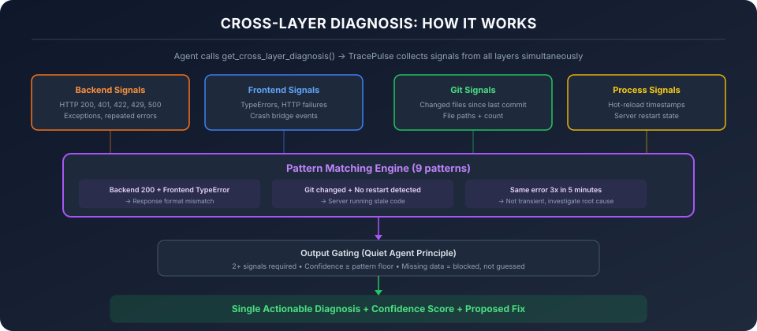

# Cross-Layer Diagnosis (DevLoop Agent)

When a bug spans multiple layers — backend returns 200 but the frontend shows "Failed" — no single tool can diagnose it. The agent calls TracePulse and sees success. It calls the browser console and sees an error. It concludes the backend is fine and spends 20 minutes debugging the wrong layer.

`get_cross_layer_diagnosis` eliminates this by correlating signals from **all layers simultaneously** and producing a single actionable diagnosis.

---

## The Problem

| What happened | What the agent saw | What it should have seen |
|---|---|---|
| Backend 200, frontend "Failed" | TP: "200 OK" / Browser: error | "Backend OK but frontend failing — check response parsing" |
| Rate limit hit from eval run | TP: "429" | "Rate limiter bucket full from eval — wait or reset" |
| Code changed but server not restarted | TP: no new errors | "Your change isn't live — server hasn't restarted" |
| Same error 3x in 5 min | TP: same error repeated | "Not transient — root cause investigation needed" |

Each tool sees one slice. `get_cross_layer_diagnosis` sees all slices at once.

---

## How It Works

<figure></figure>

```
┌─────────────────────────────────────────────┐
│         get_cross_layer_diagnosis            │
│                                             │
│  1. Collect signals from all layers         │
│  2. Match against 9 known failure patterns  │
│  3. Score by confidence + corroboration     │
│  4. Return top diagnosis with proposed fix  │
└─────────────────────────────────────────────┘
         ▲           ▲           ▲
         │           │           │
    ┌────┴────┐ ┌────┴────┐ ┌───┴────┐
    │ Backend │ │Frontend │ │Git/Proc│
    │  Logs   │ │ Errors  │ │ State  │
    └─────────┘ └─────────┘ └────────┘
```

### Signal Sources

| Layer | What it provides |
|-------|-----------------|
| **Backend** | HTTP status codes, exceptions, repeated errors |
| **Frontend** | Browser TypeErrors, HTTP failures, crash bridge events |
| **Git** | Recently changed files |
| **Process** | Hot-reload timestamps, server restart state |

### Pattern Library (9 patterns)

| Pattern | Signals Required | Confidence |
|---------|-----------------|-----------|
| Backend OK + Frontend Error | backend http-200 + frontend type-error | 75% |
| Stale Server | git file-changed + process no-restart | 80% |
| Rate Limited | backend http-429 | 85% |
| Repeated Error | backend repeated-error (3x+) | 70% |
| Schema Validation | backend http-422 | 85% |
| Build Error + Runtime | backend exception + git file-changed | 65% |
| Auth Expired | backend http-401 | 80% |
| Silent Failure | backend http-200 + frontend http-failure | 70% |
| Build Failed Silently | backend exception + git file-changed + hot-reload | 60% |

---

## Output Gating (Quiet Agent Principle)

To prevent alert fatigue, diagnoses are only surfaced when:

1. **2+ signals corroborate** — single-signal observations are logged but not shown (except for unambiguous patterns like 429, 422, 401)
2. **Confidence meets the floor** — `proposed_fix` is null when confidence is below the pattern's threshold
3. **Missing data blocks diagnosis** — if a layer fails to return data, it's reported in `missing_signals` rather than producing a guess

---

## Usage

```
get_cross_layer_diagnosis(time_window_seconds?: 60)
```

**Parameters:**
- `time_window_seconds` — How far back to look for signals (default 60, max 300)

**Response:**
```json
{
  "diagnoses": [{
    "pattern_id": "backend-ok-frontend-error",
    "confidence": 85,
    "diagnosis": "Backend returned 200 OK but frontend threw a TypeError...",
    "suggested_fix": "Check the response structure at the frontend call site.",
    "proposed_fix": "Check the response structure at the frontend call site.",
    "layers_involved": ["backend", "frontend"]
  }],
  "signals_collected": 4,
  "layers_active": ["backend", "frontend", "git"],
  "snapshot_timestamp": "2026-05-17T15:30:00.000Z",
  "missing_signals": []
}
```

---

## When to Use

- **After `get_errors` shows nothing** but the frontend is broken
- **When the same fix keeps failing** — the agent may be debugging the wrong layer
- **After code changes** — to check if the server picked up the change
- **When 429s appear** — to understand if it's a rate limit vs. a real bug

---

## Relationship to Other Tools

| Tool | What it does | When to use |
|------|-------------|-------------|
| `get_errors` | Backend errors only | First check — is there a backend error? |
| `get_correlated_errors` | HTTP pair matching | When you know it's a frontend-backend mismatch |
| `correlate_with_diff` | Error ↔ git file matching | When you suspect your recent edit caused it |
| **`get_cross_layer_diagnosis`** | **All layers at once** | **When you don't know which layer is broken** |
