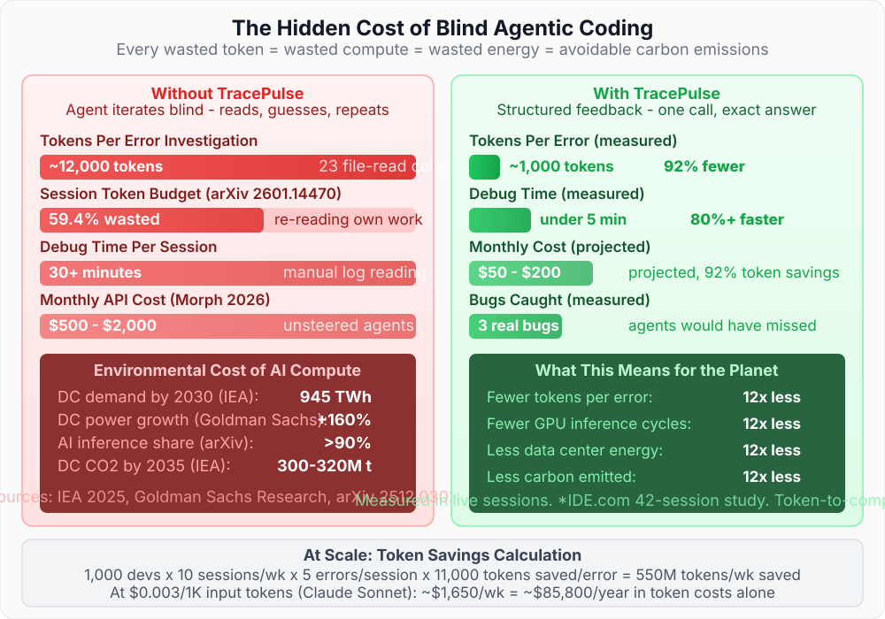
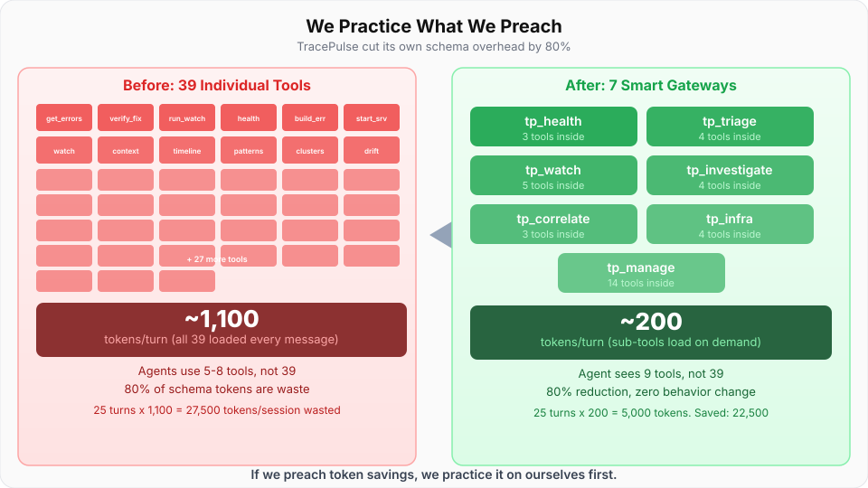

# Why TracePulse?

## Your Agent Is Coding Blind

AI coding agents write code. They run it. Then they have no idea what happened.

If the server crashes, the agent doesn't know. If a database query fails, the agent doesn't know. If a migration is pending, the agent doesn't know. It keeps building on top of broken foundations - compounding errors, burning tokens, wasting your time.

---

## The Three Blind Spots

**Blind spot one: the backend crashes, and the agent does not notice.**

When you run `npx tracepulse start "npm run dev"` - or any dev server command - TracePulse sits between the process and the agent. Without something like this, the agent has no stdout access. The server throws an unhandled exception. The agent keeps talking about the code it just wrote. It does not know the thing is on fire.

**Blind spot two: the same error fires 42 times, and the agent reads it 42 times.**

This happens on real sessions. A misconfigured database connection throws the same error on every request. The agent sees the first instance, attempts a fix, the error recurs, the agent sees it again - treats it as new information, attempts another fix, repeat. No deduplication. No "you've already looked at this." Just 42 separate reads of the same stack trace, each one consuming tokens as if it were a fresh discovery.

**Blind spot three: the agent declares victory before checking.**

This one is the most insidious. The agent makes a change. The agent says "fixed." The error is still firing. But the agent has already moved on, and the next few messages are the agent building on top of a broken foundation. By the time the developer notices, the context has drifted, the fix attempt is buried three turns back, and untangling it costs more than starting over.

These are not edge cases. They are the default behavior when you give an agent a coding task and a dev server with no observability layer.

---

## The Barrier to Autonomous Coding

These blind spots are not just token waste - they are the single biggest barrier to autonomous coding sprints.

When an agent can't see runtime errors, every automated session eventually hits a wall. The agent writes code, the code breaks at runtime, the agent doesn't know, it keeps building on the broken foundation, and the entire sprint stalls. The developer has to step in, read the terminal, paste the error, explain the context, and restart the agent's train of thought. All development stops until a human provides the feedback the agent should have gotten automatically.

This is why "let the agent run overnight" doesn't work today. Not because the agent can't write code - it can. But because the agent can't verify that the code it wrote actually runs. Without runtime feedback, autonomous sprints are fundamentally impossible. The agent will always need a human to tell it "the server crashed" or "the migration didn't apply" or "the test is failing."

TracePulse removes the human from this loop. The agent calls `get_errors()` and knows immediately. It calls `verify_fix()` and gets a definitive pass/fail. It calls `get_project_health()` and sees the full picture in one call. No human needed. No stalled sprints. No "check the terminal."

**This is what makes autonomous coding sprints possible:** not smarter models, but closing the feedback loop between the agent and the runtime.

---

## Why Not Just Read the Terminal?

The most common workaround is "check the terminal" or "paste the error." Here's why that falls short - for your workflow and for the planet:

| | Manual log reading | TracePulse |
|---|---|---|
| **Tokens per error** | ~12,000 (agent reads raw logs) | ~1,000 (structured JSON) |
| **Energy impact** | 12x more compute per error | Minimal inference cost |
| **Error detection** | Agent must be told to look | Automatic - errors scored and ranked |
| **Deduplication** | Same error read 42 times | Fingerprinted - shown once with count |
| **File:line** | Agent parses raw stack trace | Extracted and structured |
| **Fix verification** | "I think I fixed it" | `verify_fix()` - definitive pass/fail |
| **Hot-reload** | Agent doesn't know if change took effect | 12 framework detectors |
| **Infrastructure** | Agent can't see if Redis/Postgres is down | Auto-discovered from .env, probed every 60s |

Manual log reading costs 12x more tokens and gives the agent unstructured text it has to parse. That's 12x more compute, more energy, and more carbon - for a worse result.

<figure></figure>

---

## The Agent Doesn't Have to Ask

Without TracePulse, the debugging loop is:

1. Agent edits code
2. You check the terminal
3. You copy-paste the error into chat
4. Agent reads it, guesses a fix
5. Repeat 5-10 times

With TracePulse:

1. Agent edits code
2. Agent calls `get_errors()` - sees the error instantly
3. Agent fixes it
4. Agent calls `verify_fix()` - confirmed clean
5. Done

Zero human intervention. Zero copy-paste. Zero guessing.

---

## It's Not Just About Speed

Every wasted token is wasted compute, wasted energy, and avoidable carbon emissions.

- [59.4% of token consumption](https://arxiv.org/html/2601.14470v1) in agentic coding goes to the agent re-reading its own work
- Global data center electricity demand projected to [double to ~945 TWh by 2030](https://www.iea.org/news/ai-is-set-to-drive-surging-electricity-demand-from-data-centres-while-offering-the-potential-to-transform-how-the-energy-sector-works) (IEA, 2025)
- [LLM inference accounts for >90%](https://arxiv.org/html/2512.03024) of total AI power consumption

TracePulse breaks the waste chain at the source: fewer tokens per error means less compute, less energy, less carbon. Responsible AI starts with efficient AI.

---

## Works With Every Agent

TracePulse uses the open [Model Context Protocol](https://modelcontextprotocol.io). It works with:

- **Kiro** (IDE and CLI)
- **Claude Code**
- **Cursor**
- **GitHub Copilot**
- **Windsurf**
- **Cline**
- **Any MCP-compatible agent**

No vendor lock-in. No IDE-specific plugin. One install, every agent.

---

## Zero Configuration

```bash
npx tracepulse start "npm run dev"
```

That's it. Two minutes from install to first error caught. No SDK to add to your app, no browser extension, no config file. TracePulse reads stdout/stderr - it works with any language, any framework, any dev server.

## We Practice What We Preach

TracePulse saves agents 90%+ of tokens on error investigation. But we noticed our own tool was part of the problem: 36 tool schemas at ~1,000 tokens per turn. Over a 25-turn session, that's 25,000 tokens of overhead just for TracePulse to exist in the agent's context - before a single tool is called.

<figure></figure>

So we fixed it. TracePulse's clustered mode collapses 36 tools into 7 semantic gateways. Schema overhead drops from ~1,000 to ~200 tokens per turn. The agent discovers sub-tools on demand - only loading what it actually needs.

**The math:**
- Before: 36 schemas x ~28 tokens each = ~1,000 tokens/turn x 25 turns = 25,000 tokens/session
- After: 7 gateways x ~28 tokens each = ~200 tokens/turn x 25 turns = 5,000 tokens/session
- Saved: 20,000 tokens/session - automatically, with zero behavior change

If we're going to tell developers that every wasted token is wasted compute, wasted energy, and avoidable carbon - we have to hold ourselves to the same standard. Our own schema overhead was the first thing we cut.

